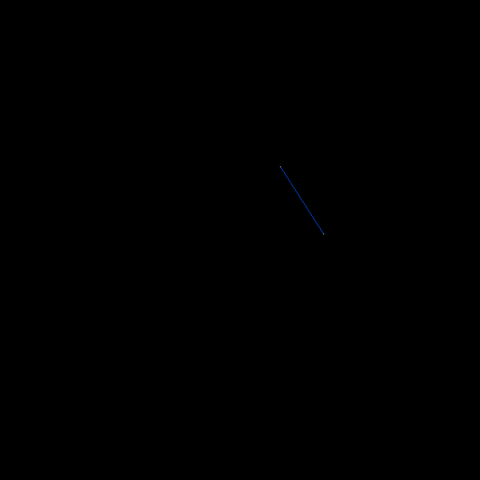
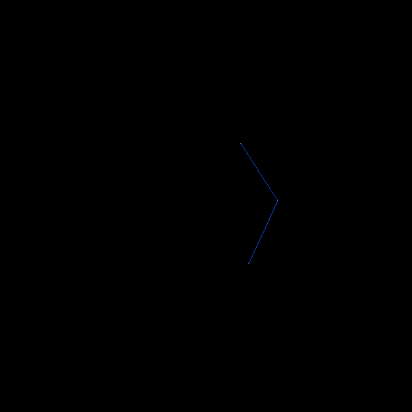
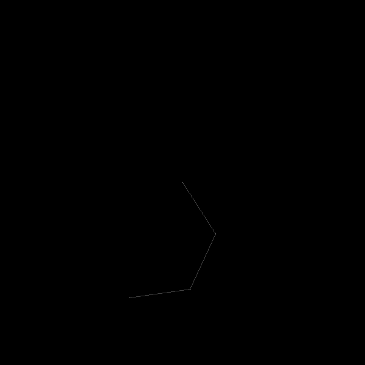
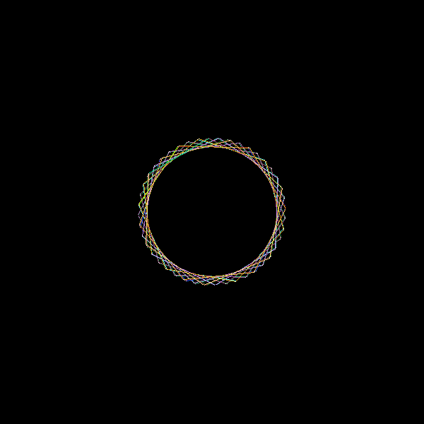
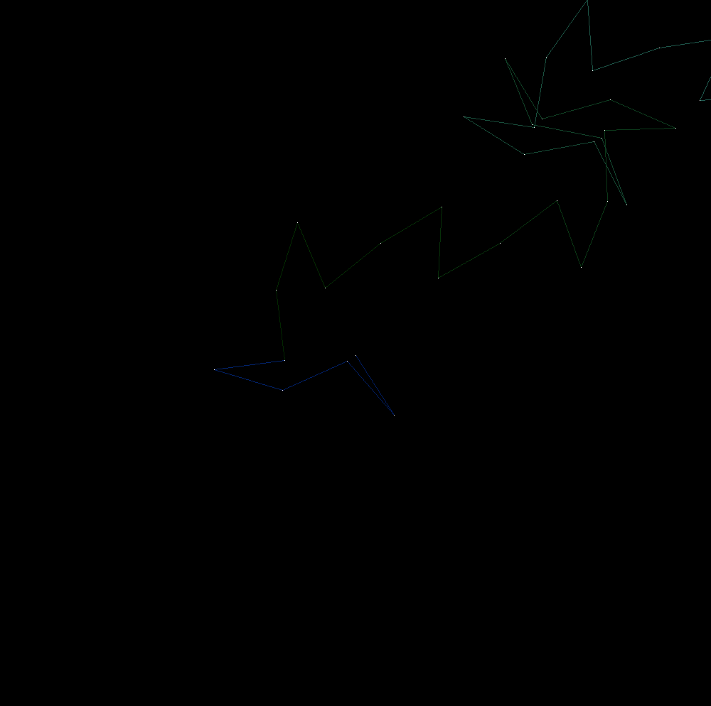

# Curlicue
An exploration of curlicue fractals, with accompanying code.

*(This is an image of a plot that I've dubbed "The Face" - more information below)*

As an amatuer mathematician/enthusiast, I've found it difficult to string together information pertaining to what are described as curlicue fractals. This repo serves to coalesce information I've found, and to present my own findings (which could very well duplicate past mathematician's work, in which case, if you have any helpful information please do not hesitate to share - I would love to learn more).

# What is a Curlicue fractal?

=39 * n ^ 2")

There are varying definitions, as multiple approaches/formulas can generate what are described in literature as curlicue fractals. However, there is one connecting theme:
1. Define a function which produces an angle (*theta*) from a given integer $`n`$:  $$θ(n)= ...$$
2. Starting from some origin point (typically $`(0, 0)`$), draw a line from this point at the angle produced by $`θ(1)`$, and with a length defined by some constant value $`r`$ (typically $`1`$).
3. From the endpoint of this line, draw a new line at angle $`θ(2)`$.
4. Repeat this process, drawing a line from the previous line, each at an angle determined by $`θ(n)`$ (where $`n`$ cooresponds to the line/iteration number, increasing sequentially by $`1`$), and each with length $`r`$.
5. Stop this process once a maximum $`n`$ value $`m`$ is reached.

The resulting plot can vary significantly depening on the $`θ(n)`$ function. Some functions can produce chaotic/fractal patterns, where others can produce bounded or simple plots.

Here is an example:
1. Define a very simple theta function: $$θ(n)=n$$
2. Let $`r=100`$ to assist in visualization.
3. Start at the origin $`(0, 0)`$:

4. Draw a line from this point at an angle of $`θ(1)`$ and with a length of $`r`$:

5. Next, draw a line from the end of the previous line, at an angle of $`θ(2)`$:

6. Do this again for $`n=3`$:

6. If we repeat this process up to $`n=100`$, the following plot will be produced:

This is certainly an interesting plot, but this $`θ(n)`$ function is very simple and the resulting circular "*Spirograph*" pattern never breaks. We can produce a much more complex plot by simply squaring $`n`$, resulting in the function: $$θ(n)=n^2$$

The following plot is produced by this function:

If we "zoom out" (set $`r=1`$), we can see the resulting pattern on a much larger scale ($`m=1000000`$, and with a coloring scheme applied):

=n ^ 2")

# Relation to Euler's formula
Euler's formula is given by: $$e^{i θ}=\cos θ + i \sin θ$$
In the curlicue fractal process described previously, lines and points are drawn on a two dimensional plane. We draw a line from the previous endpoint at an angle $`θ`$ calculated by $`θ(n)`$. A given endpoint can be expressed as a sum of previous endpoints:
$$x_{0}=0$$
$$y_{0}=0$$
$$x_{n}=x_{n - 1} + r \cos{θ(n)}$$
$$y_{n}=y_{n - 1} + r \sin{θ(n)}$$
We can instead represent this moving endpoint as a complex number, where $`x`$ is the real part, and $`y`$ is the imaginary part (and instead plot these points on the complex plane), and use Euler's formula to simplify the expression:
$$p_{0}=0$$
$$p_{n}=p_{n - 1} + r e^{i θ(n)}$$
From here, we can see that a given point $`p`$ for a cooresponding $`n`$ value $`m`$ can be expressed as a summation: $$p_{m}=\displaystyle\sum_{n=1}^m r e^{i θ(n)}$$
We can further pull the $`r`$ out using the rules of summation: $$r \displaystyle\sum_{n=1}^m e^{i θ(n)}$$
This demonstrates that $`r`$ is simply a scaling factor, and otherwise has no bearing on the summation and the resulting plot. We can remove $`r`$ and succinctly express the following: $$\text{The curlicue fractal is a plot of each term of } \displaystyle\sum_{n=1}^m e^{i θ(n)} \text{, where } θ(n) \text{ is a user defined function.}$$

# Revolutions vs. radians
Revolutions can be simpler to work with or easier to fathom than radians.

In the previous examples, $`θ(n)`$ produces an angle (a radian value). If we would instead like our $`θ(n)`$ function to produce revolutions, we can simply multiply its result by $`2 \pi`$ to convert to radians: $$2 \pi θ(n)$$
Since $`θ(n)`$ no longer returns an angle, we should no longer call it $`θ(n)`$. Let's call it $`R(n)`$ instead. We can then rewrite the previous summation as: $$\displaystyle\sum_{n=1}^m e^{i 2 \pi R(n)}$$

As it turns out, this is a helpful abstraction for the analysis of curlicue patterns, and is common in other literature, dating back to Gauss sums and possibly earlier (accounting for my own gap in knowledge).

# Relation to modular arithmetic
There is an implicit modulo operation resulting from our usage of angles and revolutions.

The angle or revolutions for a given $`n`$ produced by $`θ(n)`$ or $`R(n)`$ respectively can be greater than $`2 \pi`$ or $`1`$, and can also be less than $`0`$. We can apply modulation to these values since they will be used in $`\sin`$ and $`\cos`$, since: $$\sin θ=\sin(θ \bmod{2 \pi})$$ $$\cos θ=\cos(θ \bmod{2 \pi})$$
Therefore, we could explicitly add the implicit modulo within our sums without changing their results:
$$\displaystyle\sum_{n=1}^m e^{i θ(n)}=\displaystyle\sum_{n=1}^m e^{i (θ(n) \bmod{2 \pi})}$$
$$\displaystyle\sum_{n=1}^m e^{i 2 \pi R(n)}=\displaystyle\sum_{n=1}^m e^{i 2 \pi (R(n) \bmod 1)}$$

Although this seemingly complicates our sums without changing their behavior, noting this relationship lends itself to the analysis of curlicue patterns, and also has implications for computation (as modular arithmetic may be employed to circumvent potential limits of a computer's floating point number representation).

# Relation to Gauss sums and theta functions
I would like to further explore and document these relations (while filling in my knowledge gaps in the process), but summations which are similar to: $$\displaystyle\sum_{n=1}^m e^{i 2 \pi R(n)}$$ can be found referenced in materials pertaining to Gauss sums and theta functions:
- [Gauss sum (Wikipedia)](https://en.wikipedia.org/wiki/Gauss_sum)
- [Quadratic Gauss sum (Wikipedia)](https://en.wikipedia.org/wiki/Quadratic_Gauss_sum)
- [Theta function (Wikipedia)](https://en.wikipedia.org/wiki/Theta_function)

# Analysis of specific $`θ(n)`$ functions
In the following sections, specific forms of $`θ(n)`$ are analyzed. Each exhibit their own behavior and intricacies, and therefore are worthy of their own focus.

Also, since $`θ(n)`$ functions can arbitratily be mapped to $`R(n)`$ functions, these sections will study $`R(n)`$ functions for their tendency to simplify analysis.

There are a few formulas which will aid in analysis:
- $`a b \bmod m = (a \bmod m b) \bmod m \text{, where b and m are integers, and where a is a real number}`$
- $`a b \bmod m = (a \bmod m b \bmod m) \bmod m \text{, where a, b, and m are integers}`$
- $`a + b \bmod m = (a \bmod m + b \bmod m) \bmod m`$

# Analysis of $`R(n)=k n`$
This is perhaps the simplest form of $`R(n)`$ functions. Let $`k`$ be an arbitrary real number.

Since we can apply modulation to $`R(n)`$ functions, we can rewrite the function as: $$R(n)=k n \bmod 1$$

Let's take a moment to explore the case where $`k`$ is a rational number. In this case, we can define $`k`$ as: $$k=a/b$$
Where $`a`$ and $`b`$ are integers, and where $`b \neq 0`$.

We can then rewrite $`R(n)`$ as: $$R(n)=a n / b \bmod 1$$
From here, we can use the modulo conversion formulas: $$a \bmod m = (x a \bmod{x m}) / x$$ $$a \bmod m = x (a / x \bmod{m / x})$$
With these formulas, we can show that: $$a n / b \bmod 1=(b a n / b \bmod{b 1})/b=(a n \bmod b)/b$$ $$R(n)=(a n \bmod b) / b$$
Now, each term of the modulo operation is an integer, so rules derived from the quotient remainder theorem can be applied.

Let's look at the modular multiplication rule: $$a b \bmod m=(a \bmod m)(b \bmod m) \bmod m$$
and apply it to our function: $$R(n)=((a \bmod b)(n \bmod b) \bmod b) / b$$
# Analysis of $`R(n)=k n^2`$
# Analysis of $`R(n)=R(n-1) + k n ^ 2`$
