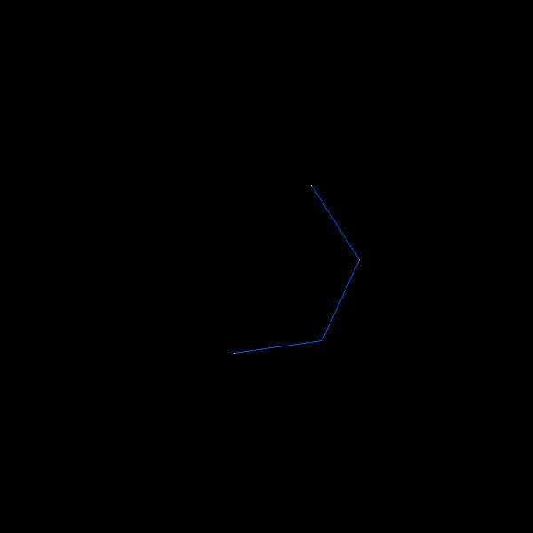

# Curlicue
An exploration of curlicue fractals, with accompanying code.

As an amatuer mathematician/enthusiast, I've found it difficult to piece together curlicue fractal information. However, the learning process is rewarding, and I hope to continue to work towards a more formalized understanding. For the curious enthusiast like myself, this article aims to consolidate and link information.

I would also like to present some of my own findings, which could very well duplicate past work. If this is the case, I apologize in advance and would very much appreciate feedback! These findings include:
- A generalized definition
- Analysis of specific functions
- The concept of an endpoint set
- Musical application

# Contributions
I hope for this article to be a community effort and to gain feedback from those interested. If you do have any feedback, improvement suggestions, or expansion suggestions, please feel free to raise an issue or to create a pull request, and I will ensure that proper attribution is made.

# Code
The supplied code is in C++. As there are only a few files, and various methods for linking SDL2, I have not provided any project or build files. Setup in your environemnt of choice should be simple. See https://wiki.libsdl.org/SDL2/Installation.

# What is a Curlicue fractal?
> $$\text{Where the function } R(n) \text{ returns a rotation, the plot of each term of}$$
> $$\displaystyle\sum_{n=1}^N e^{i 2 \pi R(n)}$$
> $$\text{may exhibit chaotic behavior if } R(n) \bmod 1 \text{ is not periodic,}$$
> $$\text{otherwise will repeat a potentially intricate, fractal-like pattern after } P \text{ terms}$$
> $$\text{(where } P \text{ is the period of } R(n) \text{).}$$
*(An attempt at a generalized definition)*
 
=39 * n ^ 2")

The preceding formula models a more intuitive system, and I hope to demonstrate that it is derived from a simple process. Multiple approaches can generate what are described as curlicue fractals. However, there is a common theme:
1. Define a function which produces an angle (*theta*) from a given integer $`n`$:  $$θ(n)= ...$$
2. Starting from some origin point (typically $`(0, 0)`$), draw a line at the angle produced by $`θ(1)`$, and with a length defined by some constant value $`r`$ (typically $`1`$).
3. From the endpoint of this line, draw a new line at angle $`θ(2)`$.
4. Repeat this process, drawing a line from the end of the previous line, each at an angle determined by $`θ(n)`$ (where $`n`$ cooresponds to the line/iteration number, increasing sequentially by $`1`$), and each with length $`r`$.
5. Stop this process once a maximum $`n`$ value, $`m`$, is reached.

The resulting plot can vary significantly based on the $`θ(n)`$ function. Some can produce patterns which are chaotic/fractal, while others produce patterns which are bounded/simple.

## Example
1. Define a simple theta function: $$θ(n)=n$$
2. Let $`r=100`$.
3. Start at the origin $`(0, 0)`$:

4. Draw a line from this point at an angle of $`θ(1)`$ and with a length of $`r`$:

5. Next, draw a line from the end of the previous line, at an angle of $`θ(2)`$:

6. Repeat this for $`n=3`$:

6. If this process is repeated up to $`n=100`$, the following plot is produced:

Although interesting, this $`θ(n)`$ function is very simple and the resulting "*Spirograph*" pattern will continue to overlap, approaching a perfect circle. A much more complex plot results from simply squaring $`n`$, expressed as the function: $$θ(n)=n^2$$

The following plot is produced by this function:

When "zoomed out" ($`r=1`$), the resulting pattern can be seen on a much larger scale ($`m=1000000`$):

=n ^ 2")

Spiral "curlicue" patterns emerge, and appear to exist at several scales. Large spirals are composed of linked smaller spirals. Perhaps this process continues indefinitely at larger and larger scales.

# Relation to Euler's formula
Euler's formula is expressed as:

$$e^{i θ}=\cos θ + i \sin θ$$

In the curlicue fractal process described previously, lines and points are drawn on a two dimensional plane. A line is drawn from the previous endpoint at an angle $`θ`$ calculated by $`θ(n)`$. A given endpoint can be expressed as a sum of previous endpoints:

$$x_{0}=0$$
$$y_{0}=0$$
$$x_{n}=x_{n - 1} + r \cos{θ(n)}$$
$$y_{n}=y_{n - 1} + r \sin{θ(n)}$$

This moving endpoint can instead be expressed as a complex number, where $`x`$ is the real part, and $`y`$ is the imaginary part (and instead plotted on the complex plane), and Euler's formula can further simplify the expression:

$$p_{0}=0$$
$$p_{n}=p_{n - 1} + r e^{i θ(n)}$$

This can also be expressed as a summation:

$$p_{N}=\displaystyle\sum_{n=1}^N r e^{i θ(n)}$$

$`r`$ can then be extracted:

$$r \displaystyle\sum_{n=1}^N e^{i θ(n)}$$

This demonstrates that $`r`$ is simply a scaling factor, and otherwise has no bearing on the summation and the resulting plot. $`r`$ can be removed, and the following can be succinctly expressed:

$$\text{A curlicue fractal may result from the plot of each term of } \displaystyle\sum_{n=1}^N e^{i θ(n)} \text{, where } θ(n) \text{ is a function which produces an angle.}$$

# Revolutions vs. radians
Revolutions can sometimes be simpler to work with and more intiuative than radians.

In the previous examples, $`θ(n)`$ produces an angle (a radian value). If we would instead like our $`θ(n)`$ function to produce revolutions, we can multiply its result by $`2 \pi`$ to convert to radians:

$$2 \pi θ(n)$$

Since $`θ(n)`$ no longer returns an angle in this case, we can instead use the name $`R(n)`$ for functions which produce a rotation. The previous summation can then be written as:

$$\displaystyle\sum_{n=1}^N e^{i 2 \pi R(n)}$$

As it turns out, this is a helpful abstraction for the analysis of curlicue patterns, and is common in other work, dating back to Gauss sums (and possibly earlier).

# Relation to modular arithmetic
There is an implicit modulo operation occuring within these summations.

The angle or revolutions for a given $`n`$ produced by $`θ(n)`$ or $`R(n)`$ respectively can be greater than $`2 \pi`$ or $`1`$, and can also be less than $`0`$. Modulation can be applied to these values since they will ultimately be used within $`\sin`$ and $`\cos`$, since:

$$\sin θ=\sin(θ \bmod{2 \pi})$$ $$\cos θ=\cos(θ \bmod{2 \pi})$$

The implicit modulos within these sums can be explicitly added without affecting their results:

$$\displaystyle\sum_{n=1}^N e^{i θ(n)}=\displaystyle\sum_{n=1}^N e^{i (θ(n) \bmod{2 \pi})}$$
$$\displaystyle\sum_{n=1}^N e^{i 2 \pi R(n)}=\displaystyle\sum_{n=1}^N e^{i 2 \pi (R(n) \bmod 1)}$$

Although this seemingly complicates the sums without changing their behavior, noting this relationship lends itself to analysis, and also has implications for computation (as modular arithmetic may be employed to circumvent potential limits of a computer's numerical representation system).

[This article on modular arithmetic](https://github.com/sonofthort/Modular-Arithmetic) contains formulas which can be useful during analysis and which are referenced in this article.

[The Wikipedia article on modular arithmetic](https://en.wikipedia.org/wiki/Modular_arithmetic) also contains many helpful formulas and identities. 

# Analysis of specific $`θ(n)`$ functions
In the following subsections, specific forms of $`θ(n)`$ are analyzed. Each exhibit their own behavior and intricacies, but also share some characteristics and analysis methodologies.

Also, since $`θ(n)`$ functions can be arbitratily mapped to $`R(n)`$ functions, these sections will study $`R(n)`$ functions for their tendency to simplify analysis.

## Analysis of $`R(n)=k`$
Let $`k`$ be an arbitrary real number. This is the simplest form of $`R(n)`$ functions.

Given:

$$\displaystyle\sum_{n=1}^N e^{i 2 \pi R(n)}$$

Substituting $`R(n)`$ with $`k`$ yields:

$$\displaystyle\sum_{n=1}^N e^{i 2 \pi k}$$

The summation function $`e^{i 2 \pi k}`$ is a constant, therefore:

$$\displaystyle\sum_{n=1}^N e^{i 2 \pi k} = N e^{i 2 \pi k}$$

The resulting plot will simply be that of a line of length $`N`$ from the origin, at an angle of $`2 \pi k`$.

### Range of $`k`$
Recall that an implicit modulo operation can be explicitly added to a rotation function:

$$R(n)=k \bmod 1$$

This shows that only values within $`0 \leq k < 1`$ are of interest, as values outside of this range map to values within this range by $`\bmod 1`$.

In other words, all angles $`0 \leq θ < 2 \pi`$ are represented by $`0 \leq k < 1`$.

For negative $`k`$ value mapping, we can refer to [these relationships](https://github.com/sonofthort/Modular-Arithmetic/blob/main/README.md#negative-numbers) to show that $`-k \bmod 1 = \lceil k \rceil - k`$.

## Analysis of $`R(n)=k n`$
Let $`k`$ be an arbitrary real number.

### Range of $`k`$
Applying the implicit modulation to this function yields:

$$R(n)=k n \bmod 1$$

From here, a [modular multiplation rule](https://github.com/sonofthort/Modular-Arithmetic/blob/main/README.md#multiplication) can be applied:

$$R(n)=(k \bmod 1) n \bmod 1$$

This again shows that only values within $`0 \leq k < 1`$ are of interest.

### Rational $`k`$ values
In the case that k is a rational number, $`k`$ can be expressed as

$$k=a/b$$

where $`a`$ and $`b`$ are positive coprime integers ($`a/b`$ is a reduced fraction), and where $`b \neq 0`$ and $`a \lt b`$.

We can then rewrite $`R(n)`$ as:

$$R(n)=a n / b \bmod 1$$

From here, we can use [modulus conversion](https://github.com/sonofthort/Modular-Arithmetic/blob/main/README.md#modulus-conversion):

$$a n / b \bmod 1=(a n \bmod b) / b$$

The modulo operands are now integers, so an [integer modular multiplication rule](https://github.com/sonofthort/Modular-Arithmetic/blob/main/README.md#multiplication) can be applied:

$$(a n \bmod b) / b = ((a \bmod b)(n \bmod b) \bmod b) /b$$

($`a \bmod b`$ is technically redundant, since $`0 \leq a \lt b`$)

As $`n`$ is the only variable, we can reduce the periodicity of this function to that of $`n \bmod b`$. Modulo is periodic by the modulus. Therefore, $`R(n)`$ will at least have a period of $`b`$. Could a smaller period than $`b`$ exist due to multiplication by $`a`$?

An algebraic approach can also be employed to determine the periodicity of this function. A periodic function can be expressed as:

$$f(x) = f(x + P) \text{, where } P \text{ is the period of the function}$$

(See [Periodic function, Wikipedia](https://en.wikipedia.org/wiki/Periodic_function))

Applying this to our function, solve for all $`P`$ values:

$$a n \equiv a (n + P) \pmod b$$

From the [Wikipedia modular arithmetic article](https://en.wikipedia.org/wiki/Modular_arithmetic#Basic_properties), we have the following:

> $$\text{If }a + k \equiv b + k \pmod m \text{, where } k \text{ is any integer, then } a \equiv b \pmod m \text{. (1)}$$
> 
> $$\text{If }k a \equiv k b \pmod m \text{ and } k \text{ is coprime with } m \text{, then } a \equiv b \pmod m \text{. (2)}$$

Attempt to apply these rules to cancel out terms:
- $`a n \equiv a (n + P) \pmod b`$
- $`a n \equiv a n + a P \pmod b`$
- This matches the form of rule (1), where $`a n`$ is the common term. Apply this rule.
- $`0 + a n \equiv a P + a n \pmod b`$
- $`0 \equiv a P \pmod b`$
- This now matches the form of the rule (2), where $`a`$ is the common term. Apply this rule.
- $`a 0 \equiv a P \pmod b`$
- $`0 = P \pmod b`$

Solving for $`P`$ yields every integer multiple of $`b`$, hence the minimum non-zero period is $`b`$.

### Irrational $`k`$ values
This is a very handwavy demonstration and not a proof, but any irrational number $`k`$ can be approximated as a rational number (fraction) by $`k \approx \lfloor k z \rfloor / z`$, where $`z`$ is an integer.

As $`z`$ approaches $`\infty`$, the approximation error approaches $`0`$. In theory, the approximation becomes equivalent to $`k`$ at $`z = \infty`$.
$$\lim_{z\to\infty} k - \lfloor k z \rfloor / z = 0$$
$$\lim_{z\to\infty} \lfloor k z \rfloor / z = k$$

In this way, an irrational number can be thought of as a fraction of infinitely large terms. Irrational $`k`$ values should result in a period of $`\infty`$. In other words, the function is not periodic.

### Describing the plot
The plot always results in a circle of some radius based on $`k`$. TODO: demonstrate how the radius can be derived from $`k`$. 

## Analysis of $`R(n)=k n^2`$
- TODO

## Analysis of $`R(n)=R(n-1) + k n ^ 2`$
- TODO
- 
# Endpoint sets
For a given rotation function $`R(n)`$ and a given $`N`$ value applied within:

$$\displaystyle\sum_{n=1}^N e^{i 2 \pi R(n)}$$

If $`R(n)`$ has within it its own variables (such as $`k`$ in the previously analyized functions), a set of all possible values results from the full (non-repeating) range of those variables and all possible combinations of those variables.

## Example
In some cases a scaling variable $`k`$ can be extracted from within $`R(n)`$, allowing us to rewrite the summation as:

$$\displaystyle\sum_{n=1}^N e^{i 2 \pi k R(n)}$$

We have shown that in this form, we need only concern ourselves with the range $`0 \leq k < 1`$.

Given this knowledge, we can construct a set of all possible endpoints as:

$$\displaystyle S= \\{ \sum_{n=1}^N e^{i 2 \pi k R(n)}|0 \leq k < 1 \text{, and }N \text{ is a constant} \\} $$

For the following $`R(n)`$ function:

$$R(n)=k n^2$$

and with an $`N`$ value of $`4`$, the following set is obtained (points plotted on the complex plain, and the axis rotated to obtain vertical symmetry):

This particular plot has several similarities to a human face, including eyes, eyeballs, mouth, nose, nostrils, ears, a jawline, a chin, the outline of a head, and something resembling an Alex Grey-esque brain (?) which connects and centralizes all other features of the face. Perhaps this is a funny coincendence, or some strange cosmic easter egg.

One might ask if there is any particular significance to the constant $`N=4`$ in this plot. As plots are observed with increasingly large $`N`$ values, there seems to be some evolution towards more complex facial features, until this effect is maximized at $`N=4`$. Beyond this, the facial features become increasingly more "alien", and soon completely fade from perception.

Strangely, there is some special significance to the number $`4`$ and this particular rotation function. There exists a special periodicity which exists with no other constants and potentially with no other rotation functions (I have yet to discover any other). TODO: Document this periodicity.

On a side note, there are some very interesting plots produced with very large $`N`$ values, and we can actually visually "zoom into" these sets to reveal their intricate details (as we do Mandelbrot Fractals), and analyze the strange points at which lines seems to coalesce. TODO: provide video and code.

## Rationale for rotating the axis
- I believe the reason that we plot real numbers horizontally, and imaginary numbers vertically within the complex plane, is largely convention, and an extension from the previously established use of horizontal number lines (which are used when dealing strictly with real numbers). Outside of the very helpful consistency this convention provides, and the agreeableness of a horizontal number line with the wide natural aspect ratio our eyes capture, there exists no purely mathematical link between real numbers and horizontality, and betweem imaginary numbers and verticality.
- I estimate that vertical symmertry is more prevelant in nature than horizontal symmetry, and that our brains are honed for viewing and analyzing vertical symmetry. Given this possibility, rotating a plot may grant the viewer a new perspective, potentially revealing features which previously went unnoticed.
- The Mandelbrot fractal, as well as a potential complex infinity of other plots, also display horizontal symmetry through our conventional alignment. Rotating these plots can grant a new perspective and also increase aesthetic value.
- In a single case study, the facial resembling features went unnoticed by myself until I rotated the plot to achieve vertical symmetry.

# Musical application
- The following repositories have used curlicue fractals to procedurally generate music:
  - https://github.com/sonofthort/amusia
  - https://github.com/sonofthort/amusia-js
- More formal description/analysis TODO

# Relation to Gauss sums and theta functions
Although I would like to further understand and document these relations, it's worth noting that summations which are similar to:

$$\displaystyle\sum_{n=1}^N e^{i 2 \pi R(n)}$$

can be found referenced in materials relating to Gauss sums and theta functions:
- [Gauss sum (Wikipedia)](https://en.wikipedia.org/wiki/Gauss_sum)
- [Quadratic Gauss sum (Wikipedia)](https://en.wikipedia.org/wiki/Quadratic_Gauss_sum)
- [Theta function (Wikipedia)](https://en.wikipedia.org/wiki/Theta_function)
