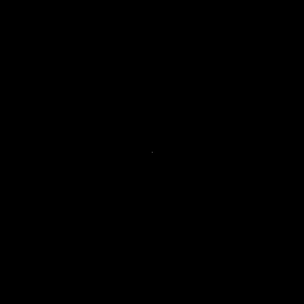

# Curlicue
An exploration of curlicue fractals.

As an amatuer mathematician/enthusiast, I've found it difficult to string together information pertaining to these fractals. This repo serves to coalesce information I've found, and to present my own findings (which could very well duplicate past mathematician's work, in which case, please let me know if you have any helpful information to share).

# What is a Curlicue Fractal?
There are varying definitions, as multiple approaches/formulas can generate what are described in literature as curlicue fractals. However, there is one connecting theme:
1. Define a function which produces an angle (*theta*) from a given integer $`n`$:  $$θ(n)= ...$$
2. Starting from some origin point (typically $`(0, 0)`$), draw a line from this point at the angle produced by $`θ(1)`$, and with a length defined by some constant value $`r`$ (typically $`1`$).
3. From the endpoint of this line, draw a new line at angle $`θ(2)`$.
4. Repeat this process, drawing a line from the previous line, each at an angle determined by $`θ(n)`$ (where $`n`$ cooresponds to the line/iteration number, increasing sequentially by $`1`$), and each with length $`r`$.
5. Stop this process once a maximum $`n`$ value, $`m`$, is reached.

The resulting plot can vary significantly depening on the $`θ(n)`$ function. Some functions can produce chaotic/fractal patterns, where others can produce bounded or simply plots.

Here is an example:
1. Define a very simple theta function: $$θ(n)=n$$
2. Let $`r=100`$ to assist in visualization.
3. Start at the origin $`(0, 0)`$:

4. Draw a line from this point at an angle of $`θ(1)`$ and with a length of $`r`$:

5. Next, draw a line from the end of the previous line, at an angle of $`θ(2)`$:

6. Do this again for $`n=3`$:

6. If we repeat this process up to $`n=100`$, the following plot will be produced:

This is certainly an interesting plot, but this $`θ(n)`$ function is very simple and the resulting circular "Spirograph" pattern never breaks. We can produce a much more complex plot by simply squaring $`n`$, resulting in the function: $$θ(n)=n^2$$

The following plot is produced from this function:

If we "zoom out" (set $`r=1`$), we can see the resulting pattern on a larger scale ($`m=1000000`$):

# Relation to Euler's formula
The very famous Euler's formula is given by: $$e^{i θ}=\cos(θ) + i \sin(θ)$$
In the curlicue fractal process described previously, lines and points are drawn on a two dimensional plane. We calculate an angle $`θ`$ using $`θ(n)`$, and draw a line from the previous end point at this angle. We can think of a given end point as a sum of previous end points:
$$x_{0}=0$$
$$y_{0}=0$$
$$x_{n}=x_{n - 1} + r \cos(θ(n))$$
$$y_{n}=y_{n - 1} + r \sin(θ(n))$$
We can represent this moving end point as a complex number, where $`x`$ is the real part, and $`y`$ is the imaginary part (and instead plot these points on the complex plane), and use Euler's formula to simplify the expression:
$$p_{0}=0$$
$$p_{n}=p_{n - 1} + r e^{i θ(n)}$$
From here, we can see that a given point $`p`$ for a cooresponding $`n`$ value $`m`$ can be expressed as a summation: $$p_{m}=\displaystyle\sum_{n=1}^m r e^{i θ(n)}$$
Therefore, the curlicue fractal can be described as a plot of each term of this summation.
